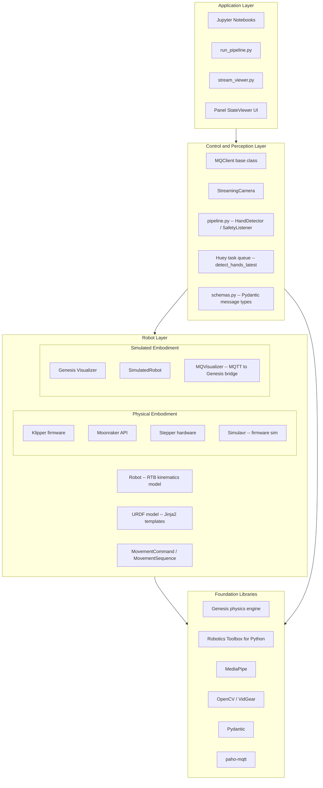
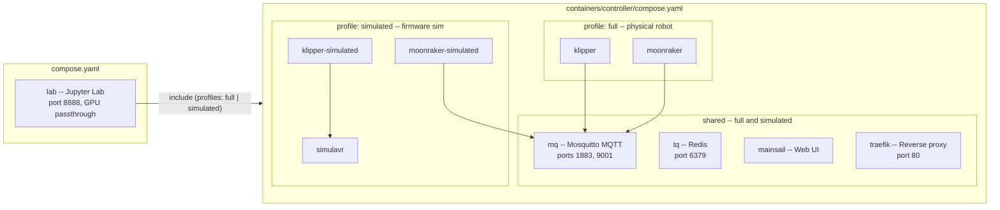
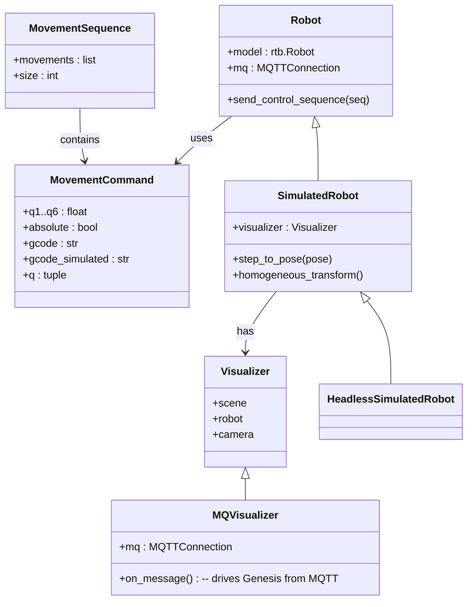
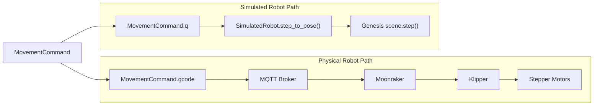
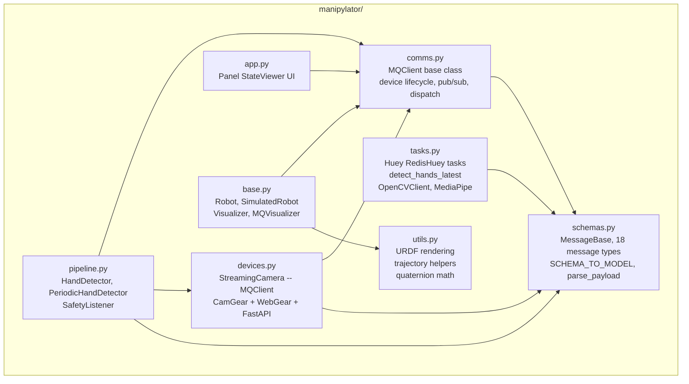
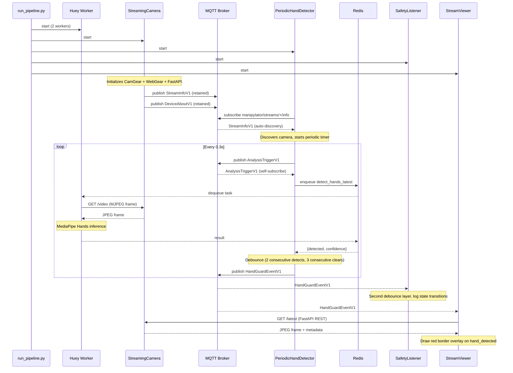

# ManiPylator Architecture

This document describes the architecture of the ManiPylator platform -- an open-source,
containerized robotics stack for a 3D-printed 6DOF manipulator arm.

---

## 1. High-Level Architecture Overview

ManiPylator is organized into four layers.  The central design principle is a clear
separation between the **Robot layer** (the thing being controlled) and the
**Control & Perception layer** (the software that observes and commands it).



**Key insight:** Genesis is a foundation library that crosses the boundary between
layers.  It can act as a **virtual robot embodiment** (substitute for the physical
arm, controlled through the same interface) *or* as a **planning / verification tool**
used by the control layer to simulate trajectories before sending them to the real
robot, or to compare observed state against expected state.

A controller should not need to know whether it is driving a real or simulated robot.

---

## 2. Container Topology

All infrastructure services are defined in two Docker Compose files.  The
`lab` container hosts the Jupyter environment, Python library, and GPU-accelerated
Genesis simulation.  The controller stack provides the MQTT broker, Redis task queue,
and -- when a physical or firmware-simulated robot is involved -- Klipper, Moonraker,
and supporting services.



### Docker Compose Profiles

| Profile      | What it starts                                                            |
|--------------|---------------------------------------------------------------------------|
| `full`       | Physical robot stack: Klipper, Moonraker, Mainsail, Traefik, MQTT, Redis |
| `simulated`  | Firmware-simulated stack: Simulavr, Klipper-simulated, Moonraker-simulated, Mainsail, Traefik, MQTT, Redis |
| `firmware`   | Klipper firmware build environment only                                   |

The physical-vs-simulated robot distinction maps directly to these profiles.
The `lab` container is always started and does not require a profile.

---

## 3. Robot Layer Deep Dive

The robot layer encompasses everything that **is** or **emulates** the physical
manipulator.  It provides two interchangeable embodiments that share a common URDF
model and command interface.

### Class Hierarchy



### Two Paths to the Robot

The same `MovementCommand` can drive either embodiment:



`MQVisualizer` bridges the two paths: it subscribes to MQTT topic `manipylator/state`
and feeds incoming joint angles directly into Genesis `robot.set_dofs_position()`.
This means a controller publishing joint states over MQTT will see them animated
in the Genesis viewer, regardless of whether a physical robot is also connected.

### URDF Pipeline

The same URDF model is shared by both RTB (for analytic kinematics) and Genesis
(for physics simulation).  URDF files are authored as Jinja2 templates in `robots/`
and rendered at runtime via the `render_robot_from_template()` context manager in
`utils.py`.

```
robots/
  empiric/
    robot.urdf.j2       # Jinja2 template
    assets/              # .part mesh files
  vanilla/
    robot.urdf.j2
```

---

## 4. Control & Perception Layer Deep Dive

This layer is responsible for observing the environment (cameras, sensors),
processing observations (hand detection, analysis), making safety decisions,
and issuing commands to the robot layer.

### 4a. Module Map



| Module        | Role                                                                                     |
|---------------|------------------------------------------------------------------------------------------|
| `schemas.py`  | Pydantic `MessageBase` and all 18 versioned message types. `SCHEMA_TO_MODEL` registry maps schema strings to model classes. `parse_payload()` deserializes MQTT bytes into typed models. |
| `comms.py`    | `MQClient` base class: MQTT connect/disconnect, subscribe, publish (Pydantic-aware), schema-based message dispatch, device lifecycle (`DeviceAboutV1` / `DeviceStatusV1`). |
| `devices.py`  | `StreamingCamera(MQClient)`: wraps CamGear for capture, WebGear for MJPEG streaming, FastAPI for REST `/latest` endpoint, publishes `StreamInfoV1` / `StreamStatusV1` / `FrameSnapshotV1` to MQTT. |
| `pipeline.py` | Vision-safety pipeline. `HandDetector(MQClient)` consumes `AnalysisTriggerV1`, runs detection via Huey, applies debounce, publishes `HandGuardEventV1`. `PeriodicHandDetector` adds auto-discovery and periodic triggering. `SafetyListener(MQClient)` consumes hand-guard events with a second debounce layer. |
| `tasks.py`    | Huey tasks backed by Redis. `detect_hands_latest` connects to the camera MJPEG stream via `OpenCVClient`, grabs the freshest frame, runs MediaPipe Hands, returns `{detected, confidence, ts_ms}`. |
| `app.py`      | Panel-based `StateViewer` UI: subscribes to `manipylator/state` and `manipylator/target` MQTT topics, displays current and target joint angles in a 2x3 grid. |
| `utils.py`    | URDF Jinja2 rendering (`render_robot_from_template`), parametric trajectory generators (heart, circle), quaternion-to-rotation-matrix conversion. |

### 4b. MQTT Topic Namespace

All MQTT topics follow the pattern `manipylator/<domain>/<entity>/<action>`.
Each message carries a `message_schema` field used for deserialization.

#### Device Discovery and Status

| Topic Pattern                           | Schema                          | Description                         |
|-----------------------------------------|---------------------------------|-------------------------------------|
| `manipylator/devices/{id}/about`        | `manipylator/device/about/v1`   | Device capabilities and endpoints (retained) |
| `manipylator/devices/{id}/status`       | `manipylator/device/status/v1`  | Online/offline state, uptime        |
| `manipylator/devices/{id}/config`       | `manipylator/device/config/v1`  | Runtime configuration snapshot      |
| `manipylator/devices/{id}/health`       | `manipylator/device/health/v1`  | CPU, memory, FPS, latency metrics   |

#### Camera Streams

| Topic Pattern                           | Schema                          | Description                         |
|-----------------------------------------|---------------------------------|-------------------------------------|
| `manipylator/streams/{camera_id}/info`  | `manipylator/stream/info/v1`    | Stream discovery: WebGear + FastAPI endpoints (retained) |
| `manipylator/streams/{camera_id}/status`| `manipylator/stream/status/v1`  | Stream online/offline, FPS, resolution |
| `manipylator/streams/{camera_id}/frame` | `manipylator/stream/frame/v1`   | Base64-encoded frame snapshot (retained) |

#### Analysis and Safety

| Topic Pattern                           | Schema                              | Description                         |
|-----------------------------------------|-------------------------------------|-------------------------------------|
| `manipylator/analysis/{proc_id}/trigger`| `manipylator/analysis/trigger/v1`   | Request analysis on a camera stream |
| `manipylator/analysis/{proc_id}/status` | `manipylator/analysis/status/v1`    | Processor online/offline            |
| `manipylator/analysis/{proc_id}/results`| `manipylator/analysis/object_offset/v1` | Object offset analysis result   |
| `manipylator/safety/hand_guard`         | `manipylator/safety/hand_guard/v1`  | Debounced hand-detection events     |
| `manipylator/safety/events`             | `manipylator/safety/event/v1`       | General safety events (pause, e-stop, resume) |

#### Robot Control

| Topic Pattern                           | Schema                              | Description                         |
|-----------------------------------------|-------------------------------------|-------------------------------------|
| `manipylator/control/commands`          | `manipylator/control/command/v1`    | Control commands (pause, resume, goto, e-stop) |
| `manipylator/control/feedback`          | `manipylator/control/feedback/v1`   | Execution status, progress, current pose |

#### Sensors

| Topic Pattern                              | Schema                            | Description                        |
|--------------------------------------------|-----------------------------------|------------------------------------|
| `manipylator/sensors/{sensor_id}/distance` | `manipylator/sensor/distance/v1`  | Distance measurement in meters     |

#### System

| Topic Pattern                           | Schema                              | Description                         |
|-----------------------------------------|-------------------------------------|-------------------------------------|
| `manipylator/system/discovery`          | `manipylator/system/discovery/v1`   | System-wide device roster           |
| `manipylator/system/health`             | `manipylator/system/health/v1`      | Aggregate system health             |
| `manipylator/system/errors`             | `manipylator/system/error/v1`       | Error events with severity          |

---

## 5. Vision-Safety Pipeline (end-to-end data flow)

The `run_pipeline.py` launcher orchestrates the full vision-safety pipeline.
This demonstrates how the control and perception layer operates independently
of which robot embodiment is active.

### Startup Sequence

`run_pipeline.py` starts three processes in order:

1. **Huey worker** -- 2 process workers consuming hand-detection tasks from Redis
2. **Pipeline** (`pipeline.py`) -- `StreamingCamera` + `PeriodicHandDetector` + `SafetyListener` in daemon threads
3. **Stream viewer** (`stream_viewer.py`) -- OpenCV GUI with MQTT-driven safety overlay

### Message Flow



### Debouncing Strategy

Safety state changes are debounced at two levels to reduce noise:

1. **HandDetector** (producer-side): requires 2 consecutive detections to publish
   `hand_detected`, and 3 consecutive clears to publish `clear`.  Detections
   trigger faster than clears (safety-first design).

2. **SafetyListener** (consumer-side): immediately reports `hand_detected` but
   requires N consecutive clear signals before confirming all-clear.

---

## 6. Build and CI (Dagger)

The `.dagger/` directory contains a Python-based [Dagger](https://dagger.io/) module
that automates:

- Building the `lab` container image (PyTorch CUDA, Genesis, Jupyter, all Python deps)
- Running Jupyter Lab and Panel services
- Python package builds

The Dagger engine configuration and cache management scripts live in
`containers/dagger-engine/`.

---

## 7. Repository Layout

```
ManiPylator/
  manipylator/              # Core Python library
    schemas.py              #   Pydantic message types and MQTT topic registry
    comms.py                #   MQClient base class (MQTT device lifecycle)
    devices.py              #   StreamingCamera(MQClient) -- camera + streaming + REST
    pipeline.py             #   HandDetector, PeriodicHandDetector, SafetyListener
    tasks.py                #   Huey tasks (detect_hands_latest, MediaPipe wrapper)
    base.py                 #   Robot, SimulatedRobot, Visualizer, MQVisualizer
    app.py                  #   Panel-based StateViewer UI
    utils.py                #   URDF rendering, trajectory helpers, quaternion math
  run_pipeline.py           # Launcher: Huey worker + pipeline + stream viewer
  stream_viewer.py          # StreamViewer: MQTT discovery + OpenCV display + safety overlay
  robots/                   # URDF Jinja2 templates + mesh assets (empiric, vanilla)
  containers/               # Docker Compose for controller stack
    controller/             #   Klipper, Moonraker, MQTT, Redis, Simulavr, Mainsail, Traefik
    lab/                    #   Lab Dockerfile
    dagger-engine/          #   Dagger engine config, cache management
  compose.yaml              # Root compose: lab container (Jupyter, GPU)
  examples/                 # Reference scripts (NetGear camera, producer, client)
  tests/                    # Test suite (discovery, latency, hand detection, profiling)
  docs/                     # Project documentation
  external/                 # Curated tutorials (spatialmathematics, dkt)
  .dagger/                  # Dagger CI/CD module (Python SDK)
  00-start-here.ipynb       # Entry-point notebook
  1x-*.ipynb                # Kinematics and symbolic math notebooks
  2x-*.ipynb                # Simulation notebooks (Genesis)
  3x-*.ipynb                # Physical robot control notebooks
```
